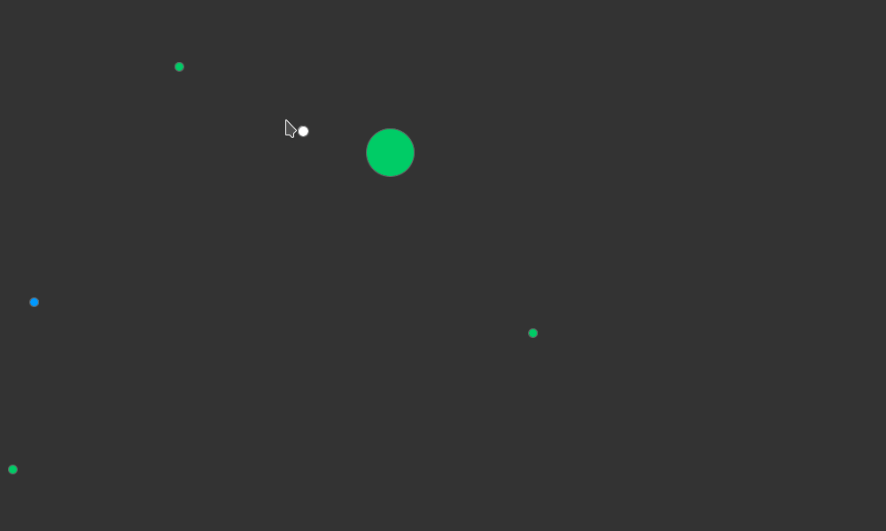

# Programação Concorrente 2021/2022

Implementação de um mini-jogo 2D onde vários utilizadores podem interagir usando um cliente Java com interface gráfica [Processing](https://processing.org/), intermediados por um servidor escrito em Erlang.

